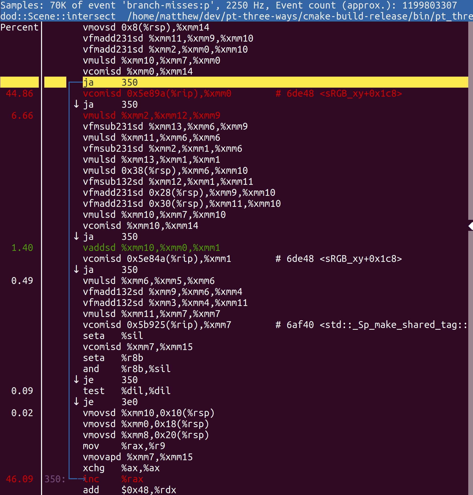
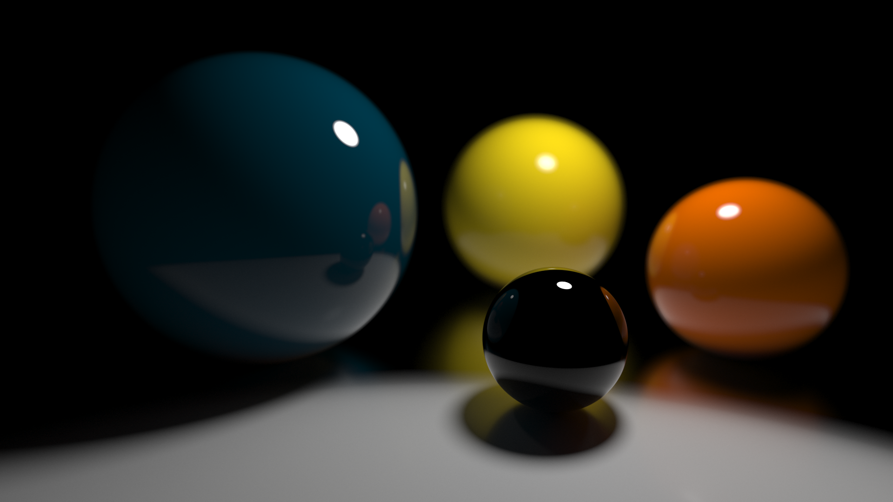

# Conclusions <!-- .element: class="white-bg" -->

---

### Favourite?

* All of the above!!
  
---

<div class="white-bg">

### Performance

* TODO redo all these!!
* Intel(R) Core(TM) i9-9980XE CPU @ 3.00GHz
* `cpupower frequency-set --governor performance`
* Single threaded

</div>


---


<div class="white-bg">

* Cornell box scene 256x256 32spp (1 sphere, 38 triangles)
* OO: 62s 
* fp: 77s
* DoD: 65s

</div>

---


<div class="white-bg">

* Owl scene 128spp (100 spheres, 12 triangles)
* OO: 68s
* fp: 96s
* DoD: 64s

</div>

---


<div class="white-bg">

* Suzanne 256x256 8spp (2 spheres, 970 triangles)
* OO: 79s
* fp: 120s
* DoD: 104s
  - what on earth!?! <!-- .element: class="fragment" -->

</div>


---

### What happened? <!-- .element: class="white-bg" -->

---

#### `perf stat` <!-- .element: class="white-bg" -->

##### Object oriented
```bash
   252,203,645,149   instructions    #    2.71  insn per cycle         
    23,158,824,048   branches        #  845.438 M/sec                  
       139,741,218   branch-misses   #    0.60% of all branches        
```
##### Functional
```bash
   238,866,691,159   instructions    #    1.78  insn per cycle         
    21,881,070,251   branches        #  560.513 M/sec                  
     1,105,066,725   branch-misses   #    5.05% of all branches        
```
##### Data-oriented Design
```bash
   154,821,779,748   instructions    #    1.34  insn per cycle         
    10,353,392,805   branches        #  305.213 M/sec                  
     1,242,670,094   branch-misses   #   12.00% of all branches        
```
* 12% of all branches!?! <!-- .element: class="fragment" -->

---

 

---

<pre><code class="cpp" data-trim data-noescape>
for (/* all triangles */) {
  auto u = calcU(/*...*/);
  if (u &lt; 0 || u > 1) {
    continue;
  }
  auto v = calcV(/*...*/);
  if (v &lt; 0 || u + v > 1) {
    continue;
  }
  auto dist = calcDist(/*...*/);
  if (dist < nearest) {
    nearest = dist;
  }
}
</code></pre>

---

<div class="white-bg">

### Branch Prediction

* `u < 0` unpredictable; `u > 1` unpredictable (50/50)
* `(u < 0 || u > 1)` predictable (mostly true)
  - if compiler chooses to combine comparisons<!-- .element: class="fragment" -->
* `(u < 0 || u > 1 || v < 0 || u + v > 1)` even more predictable
* Super sensitive to compiler...
  - `(u < 0) | (u > 1) | ...`
<!-- .element: class="fragment" --> 

[Link](http://localhost:10240/#g:!((g:!((g:!((h:codeEditor,i:(fontScale:2.23,j:1,lang:c%2B%2B,source:'//setup%0A++extern+double+calcU(double+someVal)%3B%0A++extern+double+calcV(double+someVal)%3B%0A++extern+double+calcDist(double+someVal)%3B%0A%0Adouble+sphereCalc(const+double+*input,+unsigned+num)+%7B%0A++double+nearest+%3D+1e100%3B%0A++for+(auto+index+%3D+0u%3B+index+%3C+num%3B+%2B%2Bindex)+%7B%0A++++auto+u+%3D+calcU(input%5Bindex%5D)%3B%0A++++if+(u+%3C+0+%7C%7C+u+%3E+1)+%7B%0A++++++continue%3B%0A++++%7D%0A++++auto+v+%3D+calcV(input%5Bindex%5D)%3B%0A++++if+(v+%3C+0+%7C%7C+u+%2B+v+%3E+1)+%7B%0A++++++continue%3B%0A++++%7D%0A++++auto+dist+%3D+calcDist(input%5Bindex%5D)%3B%0A++++if+(dist+%3C+nearest)+%7B%0A++++++nearest+%3D+dist%3B%0A++++%7D%0A++%7D%0A++return+nearest%3B%0A%7D'),l:'5',n:'0',o:'C%2B%2B+source+%231',t:'0')),k:50,l:'4',n:'0',o:'',s:0,t:'0'),(g:!((h:compiler,i:(compiler:g91,filters:(b:'0',binary:'1',commentOnly:'0',demangle:'0',directives:'0',execute:'1',intel:'0',libraryCode:'1',trim:'1'),fontScale:2.23,lang:c%2B%2B,libs:!(),options:'-O3+-march%3Dskylake+-Wall+-Werror',source:1),l:'5',n:'0',o:'x86-64+gcc+9.1+(Editor+%231,+Compiler+%231)+C%2B%2B',t:'0')),k:50,l:'4',n:'0',o:'',s:0,t:'0')),l:'2',n:'0',o:'',t:'0')),version:4) 

</div>

---

### FINAL STATS

---

<div class="white-bg">

### Not enough time...

* Code on [GitHub](https://github.com/mattgodbolt/pt-three-ways)
* Threading
* Devirtualisation
* Future directions...
* DoD improvements
* Thanks to Luka

</div>

---

### THANK YOU!

