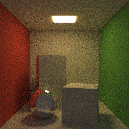
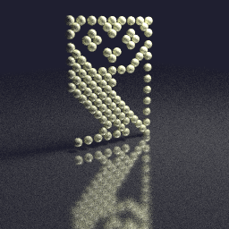

# Conclusions <!-- .element: class="white-bg" -->

---

### Favourite?

* All of the above!!

---

### Future work down the line?

* purposefully no acceleration structures
* k-d tree means subset? O(N) vs O(log N)
* not talked about threading (though had to put it in)
* Dod: first bounce: defer next radiance call?
  - make a queue of pixel/Ray/depth
  
---

<div class="white-bg">

### Performance

* TODO redo all these!!
```
[77852.398974] mce: CPU7: Package temperature above threshold, cpu clock throttled (total events = 144933)
[77852.398975] mce: CPU3: Package temperature above threshold, cpu clock throttled (total events = 144933)
```

* Intel(R) Core(TM) i9-9980XE CPU @ 3.00GHz
* `sudo cpupower frequency-set --governor performance`
* Single threaded

</div>


---

<div class="white-bg">



* Cornell box scene 256x256 32spp (1 sphere, 38 triangles)
* OO: 62s 
* fp: 77s
* DoD: 65s

</div>

---
<div class="white-bg">



* Owl scene 128spp (100 spheres, 12 triangles)
* OO: 68s
* fp: 96s
* DoD: 64s

</div>

---

<div class="white-bg">


* Suzanne 256x256 8spp (2 spheres, 970 triangles)
* OO: 79s
* fp: 120s
* DoD: 104s
  - what on earth!?! <!-- .element: class="fragment" -->

</div>


---

<div class="white-bg">

WRITE BENCHMARKS

* divide/normalisation stuff
* BENCHMARKING IS HARD!!!
  - tried benchmarking 1/x vs /x and ... looked faster until I
    fixed benchmark (x/x == 1)
  - https://godbolt.org/z/VJZEYb

</div>

---

<div class="white-bg">
 
* MYSTERY OF THE SLOW TRIANGLES in DoD
* http://localhost:10240/z/PQ3ySY
    if (v < 0 || u + v > 1|| u < 0.0 || u > 1.0)
SUPER SLOW
 * unhelpful profile...
 
```
  98.49%  pt_three_ways  pt_three_ways        [.] dod::Scene::intersect
   0.61%  pt_three_ways  libm-2.27.so         [.] __sincos
   0.20%  pt_three_ways  pt_three_ways        [.] dod::Scene::render(
```

</div>

---

<div class="white-bg">

### If only I had more time...

</div>